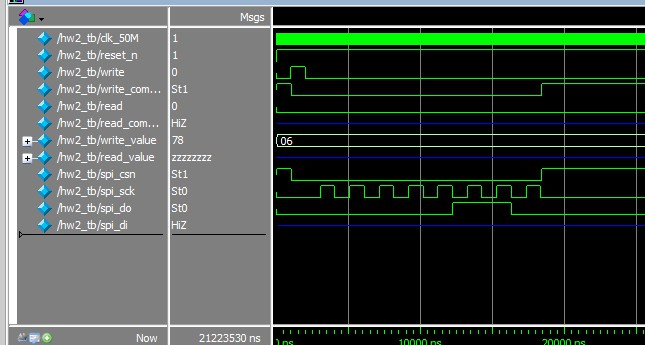

# SPI_Master_IP
 This project is made by Quartus Lite

- ## Goal 
    - Creating a SPI Master IP
    - Writing some datas in following address to EEPROM
      1. Address 0 : data => 0x78
      2. Address 1 : data => 0x9A
      3. Address 2 : data => 0xBC
    - Using M25AA010A.v as SPI Slave EEPROM model
    - It require Synchronous Design, and it should use clk_50M or reset as clock, it can't use other signal as clock.
- ## Results
    - Log text
      

    - a part of wave graph
      

    - whole wave graph
      
